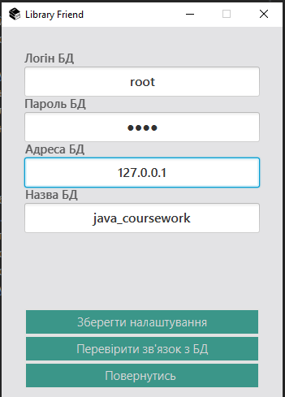

## Курсовий проєкт по Джаві двох сильно зайобен студентів ##

### Загальний опис ###

Назва проєкту - Друг бібліотекаря  
Завдання - автоматизувати облік книжок у бібліотеках  
Для чого взагалі то ми робимо?
* Щоб не вилетіти з універу
* Розвити навички командної роботи та роботи з git (саме через це, цей проєкт тут)
* Я в душі не чаю, чого саме Java, але здається, ця робота прокачає навички програмування  
UPD: Збулись цієї курсової, і за роботу отримали 94 з 100 балів, і на тому дякую

### Засоби, котрі використовуються для розробки ###

Якщо ти такий же неадекватний і тобі це знадобиться то тримай перелік:  
* JDK 11 і JavaFX - в якості основи проекту  
* Intellij idea - в якості середовища розробки
* Maven - для автоматичного налаштування залежностей, достатньо завантажити проєкт, і всі залежності автоматом підтягнуться  
* SceneBuilder - в якості допоміжного інструменту до JavaFX
* MySQL - в якості бази даних. 

### Структура проекту ###

* Ресурси (іконки, фотографії, файли FXML. CSS) знаходяться ось тута src/main/resources/
* Сам код знаходиться ось тута src/main/java/com/example/  

По пакетах і функціоналу є чотири групи:  
* FXApp.java - головний клас, з нього все і починається 
* controllers/ - тут класи-контролери, які виконують основну логіку програми й до них прив'язані FXML-файли
* database/ - тут класи для зв'язку з базою даних
* models/ - тут класи для зображення даних з БД

По ресурсах наступне:
* css/ - тут файли css, котрі прив'язані до всіх FXML файликів, 
і дозволяють централізовано один раз налаштовувати всі графічні параметри додатку 
* icons/ - тут розміщуються всі зображення, котрі використовуються в додатку на самій верхівці лежать основні іконки додатку
* icons/mainStageWorkers/ - тут розміщено зображення, котрі використано для розробки головного інтерфейсу для бібліотекаря
* makets/ - тут розміщено всі FXML файли, котрі використовуються під час виконання програми

### Налаштування бази даних ###

Для налаштування бази даних потрібно проробити наступні дії
* Відкрити файл setupDB/MySQL_0.6.mwb в MySQL WorkBench та виконати наступне  
Database -> Forward Engineer (Чи просто натиснути комбінацію Ctrl + G) та слідувати підказкам
* Зробити базу даних java_coursework по замовченню (ПКМ по базі даних)
* відкрити setupDB/Insert.sql в WorkBench та запустити на виконання
* далі в програмі виконати налаштування для зв'язку з БД (приклад нижче)

